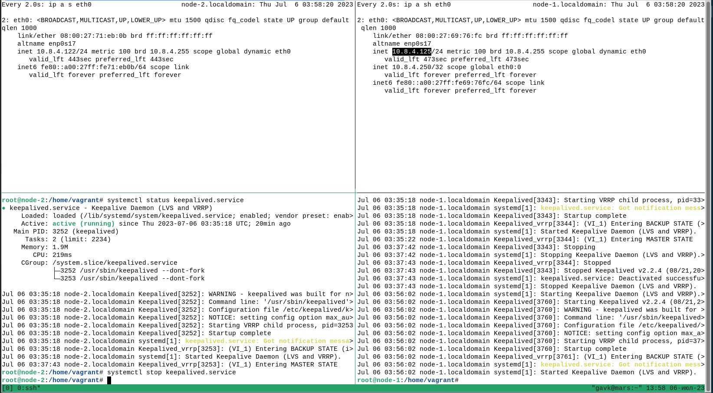
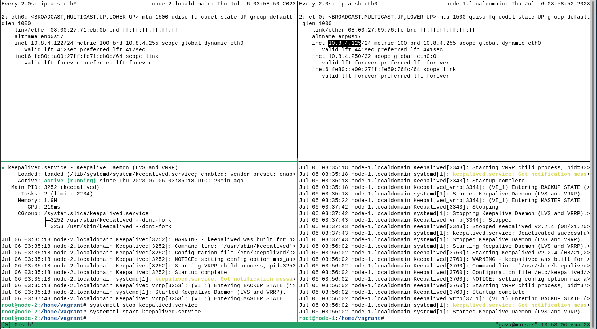
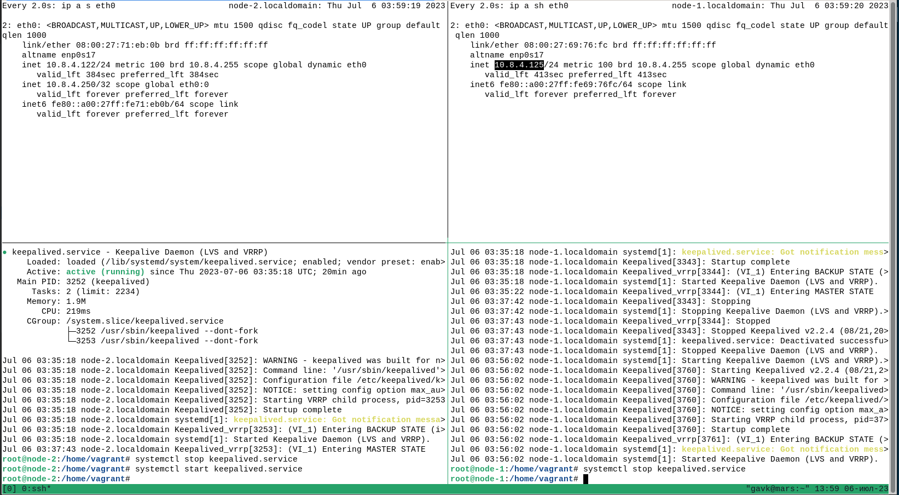
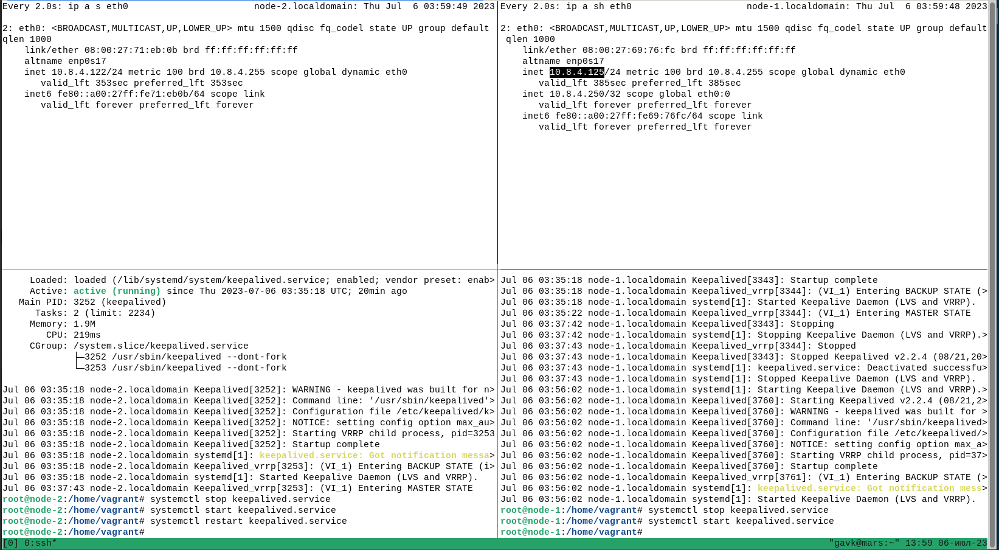
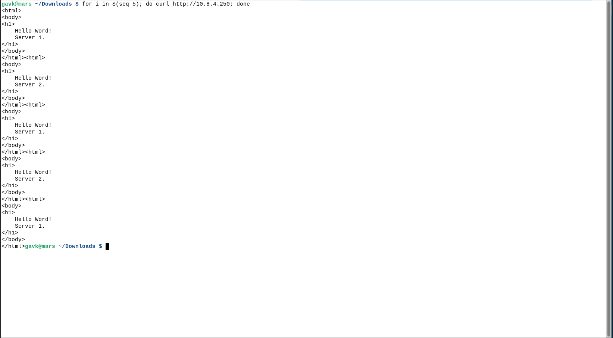

# Отчёт о выполнении задания 2.2

## Запуск решения

```commandline
cd ansible
ansible-playbook playbook.yml
```

## Проверка решения

Ход проверки решения приведён на следующих скриншотах:
Некоторое состояние системы (я сначала провёл эксперименты, чтобы убедиться, что всё работает)

Запустил `keepalived` на node-2

Выключил `keepalived` на node-1

Перезапустил `keepalived` на node-2

Проверил доступность бекендов
